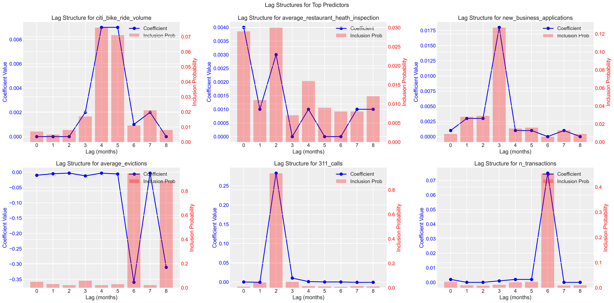

# A Bayesian Framework for Temporal Variable Selection in Autocorrelated Systems

- [Full Report](report.pdf)
- [Code](bayesian_analysis.ipynb)
- [Data](nyc_housing_data.csv)

## Overview

This project presents a Bayesian spike-and-slab framework for identifying predictive temporal structures in high-dimensional, autocorrelated datasets. The model employs sparsity-inducing priors to probabilistically select informative predictors from a large set of lagged variables, focusing on inference rather than data specificity.

Applied to NYC housing prices, the method identifies key lagged indicators with high posterior inclusion probabilities while offering interpretable posterior distributions over coefficients and outcomes. These posterior insights—alongside posterior predictive checks—enable evaluation of model fit and predictive reliability not through single metrics, but via full distributional behavior.

The analysis demonstrates how Bayesian modeling provides not just selection, but structured uncertainty quantification and probabilistic reasoning across interchangeable time-dependent datasets.

## Results

Numbers below come from the [report](report.pdf) (Table 2 and the model-fit table).

**Candidates.** 54 predictors: six monthly NYC indicators (Citi Bike rides, restaurant health scores, new business applications, evictions, 311 calls and property transactions), each at lags of 0 to 8 months. The data has 102 monthly observations, late 2014 to early 2023.

**Selection.** Four predictors stand out by posterior inclusion probability (PIP). The remaining 50 have a PIP of 0.10 or less.

| Predictor (lag) | PIP | Coef. mean (standardized) | 95% HDI |
| --- | --- | --- | --- |
| 311 calls (2 months) | 0.923 | 0.285 | (0.00, 0.42) |
| Evictions (8 months) | 0.848 | -0.312 | (-0.49, -0.11) |
| Evictions (6 months) | 0.839 | -0.328 | (-0.55, -0.17) |
| Transactions (6 months) | 0.482 | 0.082 | (-0.10, 0.22) |

**Fit.** In-sample R² is 0.864 with the lagged features, against 0.774 for the same model on current-month features only (no lags).

The report notes that the COVID-19 eviction pause likely inflates the importance of the eviction indicators.

